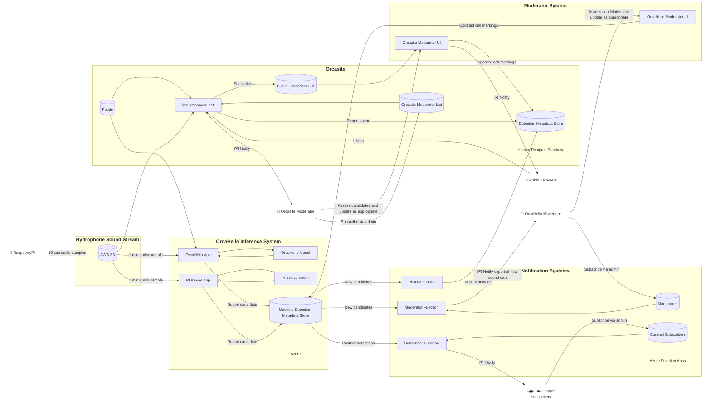
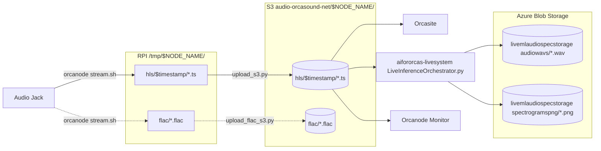

# OrcaHello: A real-time AI-assisted killer whale notification system 🎱 🐋

[Orcasound](https://www.orcasound.net/) maintains a hydrophone network in Puget Sound (near Seattle, WA, USA, Northeast Pacific). Killer whales (aka orcas) often swim by these hydrophones (underwater microphones) and vocalize with a wide range of calls.

Through annual Microsoft hackathons since 2019 and with the volunteer efforts of many [heroic Orcasound open source contributors](https://www.orcasound.net/hacker-hall-of-fame/), we have trained and continue to refine a deep learning model to find these calls in live hydrophone audio. The model is at the core of the real time inference system we call OrcaHello which aims to help recover the endangered population of Southern Resident Killer Whale (SRKW) - the iconic orcas that frequently seek salmon in Puget Sound, and also range annually from California to Alaska. OrcaHello is a part of [ai4orcas.net](https://ai4orcas.net), an International effort to apply cutting-edge artificial intelligence to orca conservation.

Learn more about OrcaHello via:

- **[OrcaHello project summary page](https://ai4orcas.net/portfolio/orcahello/)** (for general public and context)
- **[Deployed public/moderator UI](https://aifororcas.azurewebsites.net/)** (public access to detections, plus moderation features upon authentication)
- **[OrcaHello wiki](https://github.com/orcasound/aifororcas-livesystem/wiki)** (for system administrators and moderators)
- **This README** (for developers and data scientists) 

This repository contains the implementations for the following components that make up the OrcaHello real time inference system:
- [ModeratorFrontEnd](ModeratorFrontEnd) - Frontend code for the [Moderator Portal](https://aifororcas.azurewebsites.net/).
- [NotificationSystem](NotificationSystem) - Code to trigger email notifications.
- [InferenceSystem](InferenceSystem) - Code to perform inference with the trained model.
- [ModelTraining](ModelTraining) - Data preparation and model training.
- [ModelEvaluation](ModelEvaluation) - Benchmarking trained models on test sets.

## System overview
The diagram below describes the flow of data through OrcaHello and the technologies used. 

As of September, 2025, the data flow steps include:
1. **Live streaming of audio data via AWS** (from Raspberry Pis running [orcanode code](https://github.com/orcasound/orcanode) to [Orcaound's S3 open data registry buckets](https://registry.opendata.aws/orcasound/))
2. **Azure-based analysis** (via AKS in 2021-2, ICI 2019-2020; ingestion of 10-second segments from S3, inference on 2-second samples using the current OrcaHello binary call classifier, concatenation of raw audio into 60-second WAV files and spectrogram generation) 
3. **Moderation** of model detections by orca call experts (moderator notification, authentication in moderator portal, annotation and validation)
4. **Notification** of confirmed calls from endangered orcas for a wide range of subscribers (researchers, community scientists, managers, outreach/education network nodes, marine mammal observers, dynamic mitigation systems, oil spill response agencies, enforcement agencies, Naval POCs for sonar testing/training situational awareness, etc.)

A more detailed audio data flow is:

Each overlapping 2-second data segment is classified as a whale call or / not. Shown below is a 1-minute segment of hydrophone audio visualized as a spectrogram with whale calls detected by the model (delineated by white boundaries).

When whale activity is detected by the model, it sends an email to our Moderators who are killer whale experts (bioacousticians). 

Once they receive this notification, they can visit the public [Moderator Portal](https://aifororcas.azurewebsites.net/) shown below to confirm or reject model detections, and to annotate each candidate.

Most importantly, they confirm whether or not the whale call was emitted by an endangered Southern Resident Killer Whale (SRKW). If a SRKW is confirmed, notifications are sent to subscribers, like this email message (2022 example):

## Contributing
You can contribute by
1. Creating an issue to capture problems with the Moderator Portal and documentation [here](https://github.com/orcasound/aifororcas-livesystem/issues).
2. Forking the repo and generating a pull request to fix an issue with the code or documentation.
3. Joining the Orcasound open source organization on Github to edit the wiki and/or help review pull requests.

To contribute a pull request for a specific subsystem, please read the corresponding contributing guidelines and READMEs. 

- ModeratorFrontEnd | [README](ModeratorFrontEnd/README.md)  | [Contributing Guidelines](ModeratorFrontEnd/CONTRIBUTING.md)
- NotificationSystem | [README](NotificationSystem/README.md) | [Contributing Guidelines](NotificationSystem/CONTRIBUTING.md)
- InferenceSystem | [README](InferenceSystem/README.md) | [Contributing Guidelines](InferenceSystem/CONTRIBUTING.md)
- ModelTraining | [README](ModelTraining/README.md) | [Contributing Guidelines](ModelTraining/CONTRIBUTING.md)

Current subteams and leads are as follows:
- Machine Learning and Artificial Intelligence (Lead: Patrick Pastore): this subteam deals with the ModelTraining subsystem
- Inference System (Lead: Sofia Yang): this subteam deals with the InferenceSystem subsystem
- Notification System (Lead: Dave Thaler): this subteam deals with the NotificationSystem subsystem
- Infrastructure (Lead: Dave Thaler): this subteam deals with Azure and GitHub infrastructure

New volunteers are welcome in all subteams.

## General Resources
[Project Page](https://ai4orcas.net/portfolio/orcahello-live-inference-system/) - contains information about the system and a brief history of the project.

## Related Projects
- [ai4orcas.net](https://ai4orcas.net)
- [aifororcas-podcast](https://github.com/orcasound/aifororcas-podcast) - A tool to crowdsource labeling of whale calls in Orcasound's hydrophone data.
- [aifororcas-orcaml](https://github.com/orcasound/aifororcas-orcaml) - Original baseline machine learning model and data preparation code.
- [orcasite](https://github.com/orcasound/orcasite) - Authoritative site for node information
